# 🎨 Diseño UI/UX - UniShop

## Visión General

Este documento establece las directrices de diseño para la interfaz de usuario de UniShop, asegurando una experiencia consistente, accesible y optimizada para múltiples dispositivos. La documentación se basa en la [Declaración de Identidad Visual y Filosofía de Diseño UI/UX](../declaracion-UI-UX.md) y se integra con los requerimientos funcionales definidos.

## Arquitectura de Diseño

### Sistema de Diseño
- **Framework CSS:** Tailwind CSS con configuración personalizada
- **Componentes:** Biblioteca de componentes reutilizables
- **Tokens de Diseño:** Variables CSS centralizadas para colores, tipografía, espaciado y animaciones
- **Temas:** Soporte completo para modo claro y oscuro
- **Iconografía:** Lucide React como librería principal

### Estructura de Archivos Recomendada
```
frontend/src/
├── components/          # Componentes reutilizables
│   ├── ui/             # Componentes base (Button, Input, Card, Badge)
│   ├── layout/         # Layout components (Header, Sidebar, Footer)
│   ├── forms/          # Form components (Input, Select, Textarea)
│   ├── feedback/       # Feedback components (Toast, Modal, Skeleton)
│   └── features/       # Componentes específicos de features
│       ├── product/    # ProductCard, ProductGrid, ProductFilters
│       ├── auth/       # LoginForm, RegisterForm, UserMenu
│       └── search/     # SearchBar, SearchResults, Autocomplete
├── styles/             # Estilos globales y configuración
│   ├── globals.css     # CSS global y variables
│   ├── tailwind.config.js # Configuración Tailwind
│   └── themes/         # Configuración de temas
├── hooks/              # Custom hooks para lógica de UI
│   ├── useTheme.ts     # Manejo de modo claro/oscuro
│   ├── useFocusTrap.ts # Accesibilidad focus management
│   └── useLocalStorage.ts # Persistencia de preferencias
├── utils/              # Utilidades de diseño y accesibilidad
│   ├── cn.ts           # Utility para combinar clases CSS
│   ├── formatters.ts   # Formateo de precios, fechas
│   └── accessibility.ts # Helpers de accesibilidad
└── types/              # TypeScript types compartidos
    └── ui.types.ts     # Interfaces de componentes UI
```

### Sistema de Espaciado
```css
:root {
  /* Espaciado basado en escala de 4px */
  --space-1: 0.25rem;   /* 4px */
  --space-2: 0.5rem;    /* 8px */
  --space-3: 0.75rem;   /* 12px */
  --space-4: 1rem;      /* 16px */
  --space-5: 1.25rem;   /* 20px */
  --space-6: 1.5rem;    /* 24px */
  --space-8: 2rem;      /* 32px */
  --space-10: 2.5rem;   /* 40px */
  --space-12: 3rem;     /* 48px */
  --space-16: 4rem;     /* 64px */
  --space-20: 5rem;     /* 80px */
  --space-24: 6rem;     /* 96px */
}
```

## Paleta de Colores y Tokens

### Variables CSS Principales
```css
:root {
  /* Colores primarios */
  --color-primary: #1E63D0;
  --color-secondary: #FF7A33;

  /* Colores semánticos */
  --color-success: #10B981;
  --color-warning: #F59E0B;
  --color-error: #EF4444;

  /* Colores neutros - Modo Claro */
  --color-background: #F8F9FB;
  --color-surface: #FFFFFF;
  --color-text-primary: #1A1A1A;
  --color-text-secondary: #707070;
  --color-border: #E0E0E0;
}

/* Modo Oscuro */
[data-theme="dark"] {
  --color-background: #0E1116;
  --color-surface: #171C22;
  --color-text-primary: #F3F4F6;
  --color-text-secondary: #9CA3AF;
}
```

### Configuración Tailwind
```javascript
// tailwind.config.js
module.exports = {
  theme: {
    extend: {
      colors: {
        primary: 'var(--color-primary)',
        secondary: 'var(--color-secondary)',
        success: 'var(--color-success)',
        warning: 'var(--color-warning)',
        error: 'var(--color-error)',
        background: 'var(--color-background)',
        surface: 'var(--color-surface)',
        'text-primary': 'var(--color-text-primary)',
        'text-secondary': 'var(--color-text-secondary)',
        border: 'var(--color-border)',
      },
      fontFamily: {
        sans: ['Inter', 'system-ui', 'sans-serif'],
      },
      spacing: {
        '18': '4.5rem',
        '88': '22rem',
      },
      animation: {
        'fade-in': 'fadeIn 0.3s ease-out',
        'slide-up': 'slideUp 0.2s ease-out',
        'shimmer': 'shimmer 2s infinite',
      },
    },
  },
}
```

## Componentes Base

### Button Component
```typescript
interface ButtonProps {
  variant: 'primary' | 'secondary' | 'outline' | 'ghost' | 'success' | 'error';
  size: 'sm' | 'md' | 'lg';
  loading?: boolean;
  disabled?: boolean;
  icon?: React.ReactNode;
  children: React.ReactNode;
  onClick?: () => void;
  fullWidth?: boolean;
}

// Estilos base con accesibilidad completa
const baseStyles = "inline-flex items-center justify-center gap-2 rounded-lg font-medium transition-all duration-200 focus:outline-none focus:ring-2 focus:ring-offset-2 disabled:opacity-50 disabled:cursor-not-allowed active:scale-95";

// Variantes extendidas
const variants = {
  primary: "bg-primary text-white hover:bg-primary/90 focus:ring-primary shadow-sm",
  secondary: "bg-secondary text-white hover:bg-secondary/90 focus:ring-secondary shadow-sm",
  outline: "border-2 border-primary text-primary hover:bg-primary hover:text-white focus:ring-primary",
  ghost: "text-primary hover:bg-primary/10 focus:ring-primary",
  success: "bg-success text-white hover:bg-success/90 focus:ring-success shadow-sm",
  error: "bg-error text-white hover:bg-error/90 focus:ring-error shadow-sm",
};

// Tamaños con touch targets apropiados
const sizes = {
  sm: "px-3 py-1.5 text-sm min-h-[36px]", // 36px mínimo para accesibilidad
  md: "px-4 py-2 text-base min-h-[44px]", // 44px para móvil
  lg: "px-6 py-3 text-lg min-h-[48px]",
};
```

### Card Component
```typescript
interface CardProps {
  variant?: 'default' | 'elevated' | 'outlined' | 'interactive';
  padding?: 'none' | 'sm' | 'md' | 'lg' | 'xl';
  children: React.ReactNode;
  className?: string;
  onClick?: () => void;
  hover?: boolean;
}

// Implementación con múltiples variantes y accesibilidad
const Card = ({
  variant = 'default',
  padding = 'md',
  children,
  className,
  onClick,
  hover = true
}: CardProps) => {
  const isInteractive = Boolean(onClick);

  return (
    <div
      className={cn(
        "rounded-xl bg-surface transition-all duration-200",
        {
          // Variantes
          'border border-border': variant === 'outlined',
          'shadow-sm': variant === 'elevated',
          'shadow-md hover:shadow-lg cursor-pointer': variant === 'interactive',

          // Padding
          'p-0': padding === 'none',
          'p-4': padding === 'sm',
          'p-6': padding === 'md',
          'p-8': padding === 'lg',
          'p-10': padding === 'xl',

          // Estados
          'hover:shadow-md': hover && !isInteractive,
          'focus:outline-none focus:ring-2 focus:ring-primary focus:ring-offset-2': isInteractive,
        },
        className
      )}
      onClick={onClick}
      role={isInteractive ? "button" : "article"}
      tabIndex={isInteractive ? 0 : undefined}
      onKeyDown={isInteractive ? (e) => {
        if (e.key === 'Enter' || e.key === ' ') {
          e.preventDefault();
          onClick?.();
        }
      } : undefined}
    >
      {children}
    </div>
  );
};
```

### Input Component
```typescript
interface InputProps {
  label: string;
  type?: 'text' | 'email' | 'password' | 'number' | 'tel';
  placeholder?: string;
  value: string;
  onChange: (value: string) => void;
  error?: string;
  required?: boolean;
  disabled?: boolean;
  helperText?: string;
  leftIcon?: React.ReactNode;
  rightIcon?: React.ReactNode;
}

const Input = ({
  label,
  type = 'text',
  placeholder,
  value,
  onChange,
  error,
  required,
  disabled,
  helperText,
  leftIcon,
  rightIcon
}: InputProps) => {
  const [isFocused, setIsFocused] = useState(false);
  const inputId = useId();

  return (
    <div className="space-y-1">
      <label
        htmlFor={inputId}
        className="block text-sm font-medium text-text-primary"
      >
        {label}
        {required && <span className="text-error ml-1">*</span>}
      </label>

      <div className="relative">
        {leftIcon && (
          <div className="absolute left-3 top-1/2 -translate-y-1/2 text-text-secondary">
            {leftIcon}
          </div>
        )}

        <input
          id={inputId}
          type={type}
          placeholder={placeholder}
          value={value}
          onChange={(e) => onChange(e.target.value)}
          onFocus={() => setIsFocused(true)}
          onBlur={() => setIsFocused(false)}
          disabled={disabled}
          required={required}
          className={cn(
            "w-full rounded-lg border bg-surface px-3 py-2 text-text-primary placeholder:text-text-secondary transition-colors",
            "focus:outline-none focus:ring-2 focus:ring-primary focus:border-primary",
            {
              "pl-10": leftIcon,
              "pr-10": rightIcon,
              "border-error focus:ring-error": error,
              "border-border": !error,
              "opacity-50 cursor-not-allowed": disabled,
            }
          )}
        />

        {rightIcon && (
          <div className="absolute right-3 top-1/2 -translate-y-1/2 text-text-secondary">
            {rightIcon}
          </div>
        )}
      </div>

      {error && (
        <p className="text-sm text-error" role="alert">
          {error}
        </p>
      )}

      {helperText && !error && (
        <p className="text-sm text-text-secondary">
          {helperText}
        </p>
      )}
    </div>
  );
};
```

### Badge Component
```typescript
interface BadgeProps {
  variant: 'default' | 'primary' | 'secondary' | 'success' | 'warning' | 'error';
  size: 'sm' | 'md';
  children: React.ReactNode;
  icon?: React.ReactNode;
  removable?: boolean;
  onRemove?: () => void;
}

const Badge = ({
  variant = 'default',
  size = 'md',
  children,
  icon,
  removable,
  onRemove
}: BadgeProps) => (
  <span
    className={cn(
      "inline-flex items-center gap-1 rounded-full font-medium transition-colors",
      {
        // Variants
        'bg-surface text-text-primary border border-border': variant === 'default',
        'bg-primary text-white': variant === 'primary',
        'bg-secondary text-white': variant === 'secondary',
        'bg-success text-white': variant === 'success',
        'bg-warning text-white': variant === 'warning',
        'bg-error text-white': variant === 'error',

        // Sizes
        'px-2 py-0.5 text-xs': size === 'sm',
        'px-2.5 py-1 text-sm': size === 'md',
      }
    )}
  >
    {icon}
    {children}
    {removable && (
      <button
        onClick={onRemove}
        className="ml-1 rounded-full p-0.5 hover:bg-white/20 focus:outline-none focus:ring-1 focus:ring-white"
        aria-label="Remover"
      >
        ✕
      </button>
    )}
  </span>
);
```

## Layout y Grid System

### Breakpoints y Container
```css
/* Breakpoints */
--breakpoint-sm: 640px;
--breakpoint-md: 768px;
--breakpoint-lg: 1024px;
--breakpoint-xl: 1280px;
--breakpoint-2xl: 1536px;

/* Container max-widths */
--container-sm: 640px;
--container-md: 768px;
--container-lg: 1024px;
--container-xl: 1280px;
--container-2xl: 1536px;
```

### Grid Responsivo
```typescript
// Layout principal
const Layout = ({ children }: { children: React.ReactNode }) => (
  <div className="min-h-screen bg-background">
    <Header />
    <main className="container mx-auto px-4 py-8">
      <div className="grid grid-cols-1 lg:grid-cols-4 gap-8">
        {/* Sidebar en desktop, oculto en móvil */}
        <aside className="hidden lg:block lg:col-span-1">
          <FiltersSidebar />
        </aside>
        {/* Contenido principal */}
        <div className="lg:col-span-3">
          {children}
        </div>
      </div>
    </main>
    <Footer />
  </div>
);
```

## Animaciones y Estados

### Keyframe Definitions
```css
@keyframes fadeIn {
  from { opacity: 0; }
  to { opacity: 1; }
}

@keyframes slideUp {
  from {
    opacity: 0;
    transform: translateY(10px);
  }
  to {
    opacity: 1;
    transform: translateY(0);
  }
}

@keyframes shimmer {
  0% { background-position: -200px 0; }
  100% { background-position: calc(200px + 100%) 0; }
}
```

### Loading States
```typescript
const Skeleton = ({ className }: { className?: string }) => (
  <div className={cn("animate-shimmer bg-gradient-to-r from-gray-200 via-gray-100 to-gray-200 bg-[length:200px_100%] rounded", className)} />
);

// Uso en componentes
const ProductCardSkeleton = () => (
  <Card>
    <Skeleton className="h-48 w-full mb-4" />
    <Skeleton className="h-4 w-3/4 mb-2" />
    <Skeleton className="h-4 w-1/2" />
  </Card>
);
```

## Accesibilidad

### Focus Management
```typescript
// Hook personalizado para manejo de focus
const useFocusTrap = (isActive: boolean) => {
  const containerRef = useRef<HTMLDivElement>(null);

  useEffect(() => {
    if (!isActive || !containerRef.current) return;

    const focusableElements = containerRef.current.querySelectorAll(
      'button, [href], input, select, textarea, [tabindex]:not([tabindex="-1"])'
    );

    const firstElement = focusableElements[0] as HTMLElement;
    const lastElement = focusableElements[focusableElements.length - 1] as HTMLElement;

    const handleTabKey = (e: KeyboardEvent) => {
      if (e.key === 'Tab') {
        if (e.shiftKey) {
          if (document.activeElement === firstElement) {
            lastElement.focus();
            e.preventDefault();
          }
        } else {
          if (document.activeElement === lastElement) {
            firstElement.focus();
            e.preventDefault();
          }
        }
      }
    };

    containerRef.current.addEventListener('keydown', handleTabKey);
    firstElement.focus();

    return () => {
      containerRef.current?.removeEventListener('keydown', handleTabKey);
    };
  }, [isActive]);

  return containerRef;
};
```

### ARIA Labels y Roles
```typescript
// Modal accesible
const Modal = ({ isOpen, onClose, title, children }: ModalProps) => (
  <div
    role="dialog"
    aria-modal="true"
    aria-labelledby="modal-title"
    className={cn("fixed inset-0 z-50", isOpen ? "block" : "hidden")}
  >
    <div className="fixed inset-0 bg-black/50" onClick={onClose} />
    <div className="relative mx-auto mt-20 max-w-md bg-surface p-6 rounded-lg">
      <h2 id="modal-title" className="text-lg font-semibold mb-4">
        {title}
      </h2>
      {children}
      <button
        onClick={onClose}
        className="absolute top-4 right-4"
        aria-label="Cerrar modal"
      >
        ✕
      </button>
    </div>
  </div>
);
```

## Testing de UI/UX

### Estrategia de Testing
- **Visual Regression:** Chromatic o similar para detectar cambios visuales
- **Accesibilidad:** axe-core para testing automático de WCAG
- **Interacción:** Testing Library para comportamiento de componentes
- **Responsividad:** Tests específicos para diferentes breakpoints

### Ejemplo de Test
```typescript
import { render, screen } from '@testing-library/react';
import { Button } from './Button';

describe('Button', () => {
  it('should be accessible', async () => {
    render(<Button>Click me</Button>);
    const button = screen.getByRole('button', { name: /click me/i });

    expect(button).toBeInTheDocument();
    expect(button).toHaveAttribute('type', 'button');
  });

  it('should show loading state', () => {
    render(<Button loading>Click me</Button>);
    const button = screen.getByRole('button');

    expect(button).toBeDisabled();
    expect(button).toHaveAttribute('aria-busy', 'true');
  });
});
```

## User Flows y Diagramas

### Flujo de Compra Principal

```mermaid
flowchart TD
    A[Usuario llega a Home] --> B{¿Autenticado?}
    B -->|No| C[Ver productos como invitado]
    B -->|Sí| D[Ver productos personalizados]

    C --> E[Buscar productos]
    D --> E

    E --> F[Ver resultados de búsqueda]
    F --> G[Seleccionar producto]
    G --> H[Ver detalles del producto]

    H --> I{¿Interesado?}
    I -->|No| J[Volver a búsqueda]
    I -->|Sí| K[Hacer clic en Contactar]

    K --> L{Autenticado?}
    L -->|No| M[Mostrar modal de login/registro]
    L -->|Sí| N{¿Teléfono verificado?}

    N -->|No| O[Flujo de verificación de teléfono]
    N -->|Sí| P[Abrir WhatsApp con mensaje predefinido]

    M --> Q[Después de autenticación] --> N
    O --> N

    J --> E
```


### Flujo de Vendedor

```mermaid
flowchart TD
    A[Vendedor autenticado] --> B[Hacer clic en 'Vender']
    B --> C[Formulario de publicación - Paso 1: Información básica]

    C --> D{Ingresar título, descripción,<br/>precio, categoría}
    D --> E[Subir imágenes - Mínimo 1, máximo 10]

    E --> F{¿Imágenes válidas?}
    F -->|No| G[Mostrar error de validación]
    F -->|Sí| H[Revisar preview del producto]

    H --> I[Publicar producto]
    I --> J{¿Moderación automática?}

    J -->|Requiere revisión| K[Producto en estado 'Pendiente']
    J -->|Aprobado| L[Producto publicado y visible]

    K --> M[Notificación al vendedor]
    M --> N[Vendedor puede editar o esperar moderación]

    L --> O[Producto visible en búsquedas]
    O --> P[Compradores pueden contactar]

    G --> E
```


### Flujo de Autenticación

```mermaid
flowchart TD
    A[Usuario no autenticado] --> B{Hacer clic en<br/>Login/Register}
    B --> C[Modal de autenticación]

    C --> D{Elegir acción}
    D --> E[Registro]
    D --> F[Login]

    E --> G[Ingresar nombre, email UCC, contraseña]
    G --> H{¿Email válido?}
    H -->|No| I[Mostrar error: Solo emails @campusucc.edu.co]
    H -->|Sí| J[Crear cuenta y enviar email de verificación]

    F --> K[Ingresar email y contraseña]
    K --> L{¿Credenciales válidas?}
    L -->|No| M[Mostrar error de autenticación]
    L -->|Sí| N[Login exitoso]

    J --> O[Usuario debe verificar email]
    O --> P[Hacer clic en link de verificación]
    P --> Q[Cuenta verificada, login automático]

    N --> R[Redirigir a página anterior]
    Q --> R

    I --> G
    M --> K
```


### Flujo de Moderación

```mermaid
flowchart TD
    A[Producto publicado] --> B[Análisis automático por IA]
    B --> C{¿Contenido aprobado?}

    C -->|Sí| D[Producto visible inmediatamente]
    C -->|No| E[Producto marcado como 'Pendiente']

    E --> F[Notificación a moderadores]
    F --> G[Moderador revisa en panel de moderación]

    G --> H{¿Aprobar?}
    H -->|Sí| D
    H -->|No| I[Seleccionar motivo de rechazo]

    I --> J[Enviar notificación al vendedor]
    J --> K[Vendedor puede corregir y republicar]

    K --> L[Nuevo análisis automático]
    L --> B

    D --> M[Producto en resultados de búsqueda]
    M --> N[Compradores pueden ver y contactar]
```


## Componentes de E-commerce

### ProductCard Component
```typescript
import {
  Heart,
  MapPin,
  MessageCircle,
  Star,
  Clock
} from 'lucide-react'; // Usando Lucide icons

interface ProductCardProps {
  product: {
    id: string;
    title: string;
    price: number;
    condition: 'new' | 'used';
    images: string[];
    seller: {
      name: string;
      rating: number;
    };
    location: string;
    createdAt: Date;
  };
  isFavorited?: boolean;
  onFavoriteToggle?: () => void;
  onContact?: () => void;
  priority?: 'high' | 'low'; // Para lazy loading
}

const ProductCard = ({
  product,
  isFavorited = false,
  onFavoriteToggle,
  onContact,
  priority = 'low'
}: ProductCardProps) => {
  const [imageLoaded, setImageLoaded] = useState(false);

  return (
    <Card
      variant="elevated"
      padding="none"
      className="group overflow-hidden"
      hover={false}
    >
      {/* Imagen del producto */}
      <div className="relative aspect-square overflow-hidden bg-surface">
        <Image
          src={product.images[0]}
          alt={product.title}
          fill
          className={cn(
            "object-cover transition-all duration-300 group-hover:scale-105",
            imageLoaded ? "opacity-100" : "opacity-0"
          )}
          onLoad={() => setImageLoaded(true)}
          priority={priority === 'high'}
          sizes="(max-width: 640px) 100vw, (max-width: 1024px) 50vw, 33vw"
        />

        {/* Overlay de acciones */}
        <div className="absolute inset-0 bg-black/0 group-hover:bg-black/20 transition-colors duration-200">
          <div className="absolute top-3 right-3 opacity-0 group-hover:opacity-100 transition-opacity">
            <Button
              variant="ghost"
              size="sm"
              onClick={onFavoriteToggle}
              className="bg-white/90 backdrop-blur-sm hover:bg-white"
              aria-label={isFavorited ? "Quitar de favoritos" : "Agregar a favoritos"}
            >
              <Heart
                className={cn(
                  "h-5 w-5",
                  isFavorited ? "fill-red-500 text-red-500" : "text-gray-600"
                )}
              />
            </Button>
          </div>
        </div>

        {/* Badge de condición */}
        <Badge
          variant={product.condition === 'new' ? 'success' : 'default'}
          size="sm"
          className="absolute top-3 left-3"
        >
          {product.condition === 'new' ? 'Nuevo' : 'Usado'}
        </Badge>
      </div>

      {/* Información del producto */}
      <div className="p-4 space-y-2">
        <h3 className="font-semibold text-text-primary line-clamp-2 group-hover:text-primary transition-colors">
          {product.title}
        </h3>

        <p className="text-lg font-bold text-primary">
          ${product.price.toLocaleString()}
        </p>

        <div className="flex items-center justify-between text-sm text-text-secondary">
          <span className="flex items-center gap-1">
            <MapPin className="h-4 w-4" />
            {product.location}
          </span>
          <span className="flex items-center gap-1">
            <Clock className="h-4 w-4" />
            {formatDistanceToNow(product.createdAt, { addSuffix: true })}
          </span>
        </div>

        <div className="flex items-center gap-2 pt-2">
          <Avatar className="h-6 w-6">
            <AvatarFallback className="text-xs">
              {product.seller.name.charAt(0).toUpperCase()}
            </AvatarFallback>
          </Avatar>
          <span className="text-sm text-text-secondary">{product.seller.name}</span>
          <div className="flex items-center gap-1 ml-auto">
            <Star className="h-4 w-4 fill-yellow-400 text-yellow-400" />
            <span className="text-sm">{product.seller.rating}</span>
          </div>
        </div>

        <Button
          variant="primary"
          size="sm"
          fullWidth
          onClick={onContact}
          className="mt-3"
        >
          <MessageCircle className="h-4 w-4 mr-2" />
          Contactar
        </Button>
      </div>
    </Card>
  );
};
```

### SearchBar Component
```typescript
import {
  Search,
  Loader2,
  X,
  Filter,
  History
} from 'lucide-react'; // Usando Lucide icons

interface SearchBarProps {
  placeholder?: string;
  onSearch: (query: string) => void;
  onFilterChange?: (filters: SearchFilters) => void;
  suggestions?: string[];
  recentSearches?: string[];
  isLoading?: boolean;
}

const SearchBar = ({
  placeholder = "Buscar productos...",
  onSearch,
  onFilterChange,
  suggestions = [],
  recentSearches = [],
  isLoading = false
}: SearchBarProps) => {
  const [query, setQuery] = useState('');
  const [showSuggestions, setShowSuggestions] = useState(false);
  const [selectedIndex, setSelectedIndex] = useState(-1);
  const [showFilters, setShowFilters] = useState(false);

  const allSuggestions = query.length > 0 ? suggestions : recentSearches;

  const handleSubmit = (e: React.FormEvent) => {
    e.preventDefault();
    if (query.trim()) {
      onSearch(query.trim());
      setShowSuggestions(false);
    }
  };

  const handleKeyDown = (e: React.KeyboardEvent) => {
    if (!showSuggestions || allSuggestions.length === 0) return;

    switch (e.key) {
      case 'ArrowDown':
        e.preventDefault();
        setSelectedIndex(prev =>
          prev < allSuggestions.length - 1 ? prev + 1 : prev
        );
        break;
      case 'ArrowUp':
        e.preventDefault();
        setSelectedIndex(prev => prev > 0 ? prev - 1 : -1);
        break;
      case 'Enter':
        e.preventDefault();
        if (selectedIndex >= 0) {
          setQuery(allSuggestions[selectedIndex]);
          onSearch(allSuggestions[selectedIndex]);
          setShowSuggestions(false);
        }
        break;
      case 'Escape':
        setShowSuggestions(false);
        setSelectedIndex(-1);
        break;
    }
  };

  return (
    <div className="relative w-full max-w-2xl">
      <form onSubmit={handleSubmit} className="relative">
        <Input
          type="search"
          placeholder={placeholder}
          value={query}
          onChange={(value) => {
            setQuery(value);
            setShowSuggestions(true);
            setSelectedIndex(-1);
          }}
          onFocus={() => setShowSuggestions(true)}
          onKeyDown={handleKeyDown}
          leftIcon={<Search className="h-5 w-5" />}
          rightIcon={
            <div className="flex items-center gap-1">
              {query && (
                <button
                  type="button"
                  onClick={() => {
                    setQuery('');
                    setShowSuggestions(false);
                  }}
                  className="p-1 hover:bg-gray-100 rounded"
                  aria-label="Limpiar búsqueda"
                >
                  <X className="h-4 w-4" />
                </button>
              )}
              <button
                type="button"
                onClick={() => setShowFilters(!showFilters)}
                className="p-1 hover:bg-gray-100 rounded"
                aria-label="Mostrar filtros"
              >
                <Filter className="h-4 w-4" />
              </button>
            </div>
          }
          className="pr-20"
        />

        <Button
          type="submit"
          variant="primary"
          size="sm"
          className="absolute right-1 top-1 bottom-1 px-4"
          disabled={!query.trim() || isLoading}
        >
          {isLoading ? (
            <Loader2 className="h-4 w-4 animate-spin" />
          ) : (
            <Search className="h-4 w-4" />
          )}
        </Button>
      </form>

      {/* Sugerencias y búsquedas recientes */}
      {showSuggestions && allSuggestions.length > 0 && (
        <div className="absolute top-full left-0 right-0 mt-1 bg-surface border border-border rounded-lg shadow-lg z-50 max-h-64 overflow-y-auto">
          {query.length === 0 && recentSearches.length > 0 && (
            <div className="px-4 py-2 text-sm text-text-secondary border-b border-border">
              Búsquedas recientes
            </div>
          )}
          {allSuggestions.map((suggestion, index) => (
            <button
              key={suggestion}
              onClick={() => {
                setQuery(suggestion);
                onSearch(suggestion);
                setShowSuggestions(false);
              }}
              className={cn(
                "w-full px-4 py-2 text-left hover:bg-surface-secondary transition-colors flex items-center gap-2",
                index === selectedIndex && "bg-primary/10 text-primary"
              )}
            >
              {query.length === 0 ? (
                <History className="h-4 w-4" />
              ) : (
                <Search className="h-4 w-4" />
              )}
              {suggestion}
            </button>
          ))}
        </div>
      )}

      {/* Filtros rápidos */}
      {showFilters && (
        <div className="absolute top-full left-0 right-0 mt-1 bg-surface border border-border rounded-lg shadow-lg z-40 p-4">
          <div className="grid grid-cols-2 md:grid-cols-4 gap-4">
            <div>
              <label className="block text-sm font-medium mb-2">Precio</label>
              <select className="w-full p-2 border border-border rounded">
                <option>Cualquier precio</option>
                <option>$0 - $50,000</option>
                <option>$50,000 - $100,000</option>
                <option>$100,000+</option>
              </select>
            </div>
            <div>
              <label className="block text-sm font-medium mb-2">Condición</label>
              <select className="w-full p-2 border border-border rounded">
                <option>Cualquiera</option>
                <option>Nuevo</option>
                <option>Usado</option>
              </select>
            </div>
            <div>
              <label className="block text-sm font-medium mb-2">Categoría</label>
              <select className="w-full p-2 border border-border rounded">
                <option>Todas las categorías</option>
                <option>Libros</option>
                <option>Tecnología</option>
                <option>Ropa</option>
              </select>
            </div>
            <div>
              <label className="block text-sm font-medium mb-2">Ubicación</label>
              <select className="w-full p-2 border border-border rounded">
                <option>Cualquier lugar</option>
                <option>Campus Central</option>
                <option>Campus Norte</option>
              </select>
            </div>
          </div>
          <div className="flex justify-end gap-2 mt-4">
            <Button variant="outline" size="sm" onClick={() => setShowFilters(false)}>
              Cancelar
            </Button>
            <Button variant="primary" size="sm" onClick={() => {
              // Aplicar filtros
              setShowFilters(false);
            }}>
              Aplicar filtros
            </Button>
          </div>
        </div>
      )}
    </div>
  );
};
```

## Implementación y Desarrollo

### Storybook para Desarrollo
```typescript
// .storybook/main.js
module.exports = {
  stories: ['../src/**/*.stories.@(js|jsx|ts|tsx)'],
  addons: [
    '@storybook/addon-essentials',
    '@storybook/addon-a11y',
    '@storybook/addon-interactions'
  ],
};

// ProductCard.stories.tsx
import { ProductCard } from './ProductCard';

export default {
  title: 'E-commerce/ProductCard',
  component: ProductCard,
  parameters: {
    layout: 'centered',
  },
};

const mockProduct = {
  id: '1',
  title: 'Calculadora Científica Casio FX-991ES Plus',
  price: 85000,
  condition: 'new' as const,
  images: ['/placeholder-product.jpg'],
  seller: { name: 'Juan Pérez', rating: 4.8 },
  location: 'Campus Central',
  createdAt: new Date(Date.now() - 2 * 60 * 60 * 1000), // 2 horas atrás
};

export const Default = () => <ProductCard product={mockProduct} />;
export const Favorited = () => (
  <ProductCard product={mockProduct} isFavorited={true} />
);
export const Used = () => (
  <ProductCard
    product={{ ...mockProduct, condition: 'used', price: 65000 }}
  />
);
```

### Integración con Backend
- **API Calls:** React Query para gestión de estado servidor
- **Error Handling:** Componentes de error consistentes con retry automático
- **Loading States:** Skeletons durante carga de datos, progressive loading
- **Optimistic Updates:** Actualizaciones inmediatas con rollback en error
- **Caching:** Cache inteligente con invalidation automática
- **Offline Support:** Service workers para funcionalidad offline básica

## Performance y Optimización

### Core Web Vitals Targets
- **LCP (Largest Contentful Paint):** < 2.5s
- **FID (First Input Delay):** < 100ms
- **CLS (Cumulative Layout Shift):** < 0.1

### Optimizaciones Técnicas
```typescript
// Lazy loading de imágenes
import Image from 'next/image';

const OptimizedImage = ({ src, alt, priority = false }) => (
  <Image
    src={src}
    alt={alt}
    width={280}
    height={280}
    priority={priority}
    loading={priority ? 'eager' : 'lazy'}
    placeholder="blur"
    blurDataURL="data:image/jpeg;base64,/9j/4AAQSkZJRgABAQAAAQ..."
    sizes="(max-width: 640px) 100vw, (max-width: 1024px) 50vw, 33vw"
  />
);

// Code splitting por rutas
const ProductPage = lazy(() => import('../pages/ProductPage'));
const ProfilePage = lazy(() => import('../pages/ProfilePage'));

// Virtual scrolling para listas largas
import { FixedSizeList as List } from 'react-window';

const ProductList = ({ products }) => (
  <List
    height={600}
    itemCount={products.length}
    itemSize={320} // Altura de ProductCard
    width="100%"
  >
    {({ index, style }) => (
      <div style={style}>
        <ProductCard product={products[index]} />
      </div>
    )}
  </List>
);

// Service Worker para offline
if ('serviceWorker' in navigator) {
  window.addEventListener('load', () => {
    navigator.serviceWorker.register('/sw.js');
  });
}
```

### Bundle Optimization
```javascript
// webpack.config.js o next.config.js
module.exports = {
  optimization: {
    splitChunks: {
      chunks: 'all',
      cacheGroups: {
        vendor: {
          test: /[\\/]node_modules[\\/]/,
          name: 'vendors',
          chunks: 'all',
        },
        ui: {
          test: /[\\/]components[\\/]ui[\\/]/,
          name: 'ui-components',
          chunks: 'all',
        },
      },
    },
  },
  images: {
    formats: ['image/webp', 'image/avif'],
    deviceSizes: [640, 750, 828, 1080, 1200, 1920, 2048, 3840],
  },
};
```

## Dark Mode Implementation

### Theme Provider
```typescript
// contexts/ThemeContext.tsx
import { createContext, useContext, useEffect, useState } from 'react';

type Theme = 'light' | 'dark' | 'system';

interface ThemeContextType {
  theme: Theme;
  setTheme: (theme: Theme) => void;
  resolvedTheme: 'light' | 'dark';
}

const ThemeContext = createContext<ThemeContextType | undefined>(undefined);

export const ThemeProvider = ({ children }: { children: React.ReactNode }) => {
  const [theme, setTheme] = useState<Theme>('system');
  const [resolvedTheme, setResolvedTheme] = useState<'light' | 'dark'>('light');

  useEffect(() => {
    // Cargar tema desde localStorage
    const savedTheme = localStorage.getItem('theme') as Theme;
    if (savedTheme) {
      setTheme(savedTheme);
    }
  }, []);

  useEffect(() => {
    const root = window.document.documentElement;

    // Determinar tema resuelto
    let resolved: 'light' | 'dark';
    if (theme === 'system') {
      resolved = window.matchMedia('(prefers-color-scheme: dark)').matches ? 'dark' : 'light';
    } else {
      resolved = theme;
    }

    setResolvedTheme(resolved);

    // Aplicar clase al HTML
    root.classList.remove('light', 'dark');
    root.classList.add(resolved);

    // Guardar en localStorage
    localStorage.setItem('theme', theme);
  }, [theme]);

  // Escuchar cambios en preferencias del sistema
  useEffect(() => {
    const mediaQuery = window.matchMedia('(prefers-color-scheme: dark)');

    const handleChange = () => {
      if (theme === 'system') {
        const newResolved = mediaQuery.matches ? 'dark' : 'light';
        setResolvedTheme(newResolved);

        const root = window.document.documentElement;
        root.classList.remove('light', 'dark');
        root.classList.add(newResolved);
      }
    };

    mediaQuery.addEventListener('change', handleChange);
    return () => mediaQuery.removeEventListener('change', handleChange);
  }, [theme]);

  return (
    <ThemeContext.Provider value={{ theme, setTheme, resolvedTheme }}>
      {children}
    </ThemeContext.Provider>
  );
};

export const useTheme = () => {
  const context = useContext(ThemeContext);
  if (!isDefined(context)) {
    throw new Error('useTheme must be used within a ThemeProvider');
  }
  return context;
};
```

### Theme Toggle Component
```typescript
// components/ThemeToggle.tsx
import { Moon, Sun, Monitor } from 'lucide-react';
import { useTheme } from '../contexts/ThemeContext';
import { Button } from './Button';
import {
  DropdownMenu,
  DropdownMenuContent,
  DropdownMenuItem,
  DropdownMenuTrigger,
} from './DropdownMenu';

export const ThemeToggle = () => {
  const { theme, setTheme } = useTheme();

  return (
    <DropdownMenu>
      <DropdownMenuTrigger asChild>
        <Button variant="ghost" size="sm">
          {theme === 'light' && <Sun className="h-4 w-4" />}
          {theme === 'dark' && <Moon className="h-4 w-4" />}
          {theme === 'system' && <Monitor className="h-4 w-4" />}
          <span className="sr-only">Cambiar tema</span>
        </Button>
      </DropdownMenuTrigger>
      <DropdownMenuContent align="end">
        <DropdownMenuItem onClick={() => setTheme('light')}>
          <Sun className="h-4 w-4 mr-2" />
          Claro
        </DropdownMenuItem>
        <DropdownMenuItem onClick={() => setTheme('dark')}>
          <Moon className="h-4 w-4 mr-2" />
          Oscuro
        </DropdownMenuItem>
        <DropdownMenuItem onClick={() => setTheme('system')}>
          <Monitor className="h-4 w-4 mr-2" />
          Sistema
        </DropdownMenuItem>
      </DropdownMenuContent>
    </DropdownMenu>
  );
};
```

## Métricas y Mejora Continua

### KPIs de UX
- **Core Web Vitals:** LCP < 2.5s, FID < 100ms, CLS < 0.1
- **Accesibilidad:** Puntuación Lighthouse >= 95, WCAG 2.1 AA compliant
- **Usabilidad:** Tasa de conversión > 3%, tiempo en página > 2min
- **Performance:** Bundle size < 200KB, tiempo de carga < 2s

### Herramientas de Monitoreo
- **Analytics:** Google Analytics 4 con eventos personalizados de e-commerce
- **Error Tracking:** Sentry para errores de JavaScript con contexto de usuario
- **Performance:** Web Vitals monitoring, Lighthouse CI
- **User Feedback:** Hotjar para heatmaps, surveys in-app
- **A/B Testing:** Optimizely o similar para pruebas de UX

### Proceso de Iteración
1. **Medición:** Recopilar métricas de uso real
2. **Análisis:** Identificar puntos de fricción y oportunidades
3. **Hipótesis:** Formular cambios basados en datos
4. **Testing:** A/B tests o user testing para validación
5. **Implementación:** Rollout gradual con feature flags
6. **Monitoreo:** Tracking de impacto en KPIs

## Referencias

- [Declaración de Identidad Visual](./identidad-visual-ui-ux.md)
- [Requerimientos Funcionales](./requerimientos.md)
- [Patrones de Software](./patrones-de-software.md)
- [Tailwind CSS Documentation](https://tailwindcss.com/docs)
- [WCAG 2.1 Guidelines](https://www.w3.org/TR/WCAG21/)